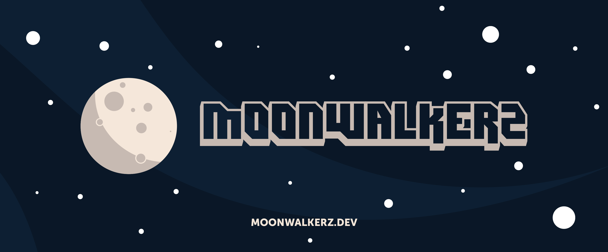

<<<<<<< HEAD

 

=======

 

>>>>>>> b6345b7b1ea7a1c53ec653f55229f1fc204745bf

### Who We Are

MoonWalkerz is passion, dedication and discovery!

MoonWalkerz expand web creating simple, easy-to-use interfaces and functional backends using open source technologies.

In a nutshell, Moonwolkerz is a full stack developer group that has been fortunate enough to turn our passions into a job!

### Coding

For Codin, now we are using:

* Laravel
* Livewire
* Alpine JS
* Vue JS
* Tailwind CSS
* Bootstrap

### Contact Us

Mail: webmaster@moonwalkerz.dev

<<<<<<< HEAD
Telegram: @MoonWalkerzDev
=======
Telegram: @MoonWalkerzDev
>>>>>>> b6345b7b1ea7a1c53ec653f55229f1fc204745bf
